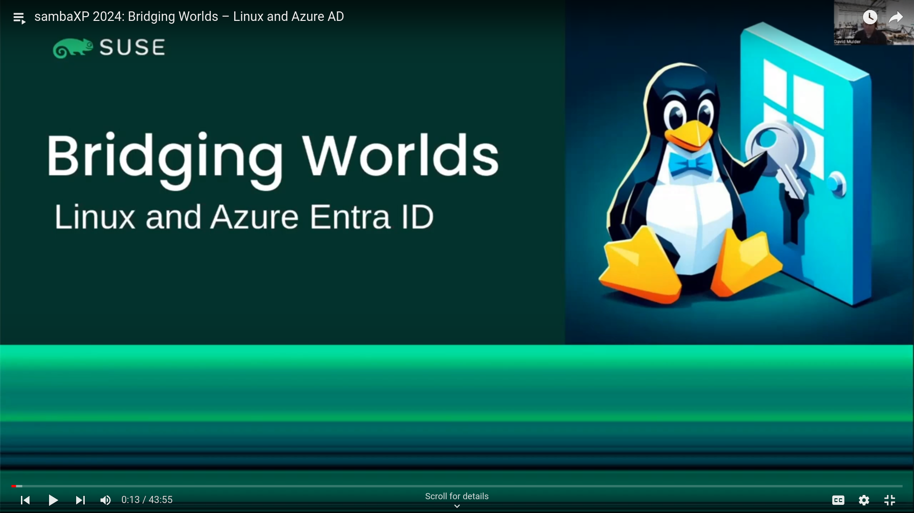
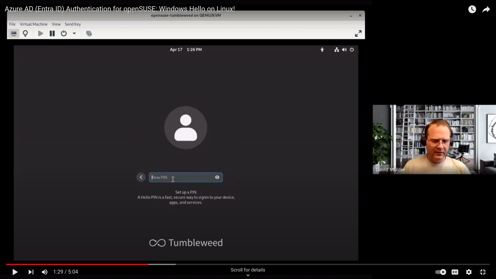
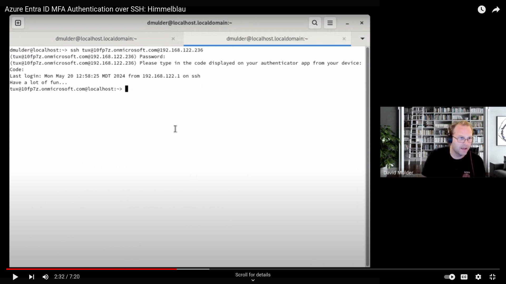

[](https://www.suse.com)

[](https://scorecard.dev/viewer/?uri=github.com/himmelblau-idm/himmelblau) [](https://www.bestpractices.dev/projects/11235)

[](https://opencollective.com/himmelblau)

# Himmelblau

Himmelblau is an interoperability suite for Microsoft Azure Entra ID and Intune.

The name of the project comes from a German word for Azure (sky blue).

Himmelblau supports Linux authentication to Microsoft Azure Entra ID via PAM and NSS modules.
The PAM and NSS modules communicate with Entra ID via the himmelblaud daemon. Himmelblau also
supports Intune device enrollment, policy enforcement, and marking devices as compliant with
Intune MDM policies.

[](https://youtu.be/wCibnqVQ_bs "Azure Entra Id Authentication for Linux")

## Sponsorship

[](https://www.suse.com)

We gratefully acknowledge [SUSE](https://www.suse.com) as the primary sponsor of the Himmelblau project. Their support enables us to develop and maintain this open-source identity management solution.

## Contact

You can reach out on the [Himmelblau community matrix channel](https://matrix.to/#/#himmelblau:matrix.org)
or on the [Samba Technical community matrix channel](https://matrix.to/#/#samba-technical:matrix.org).

## 💙 Support Himmelblau

Himmelblau is developed and maintained by [SUSE Linux](https://www.suse.com), but the **project’s operating expenses**—including hosting, domain registration, and tooling—are funded by the **community**.

These costs currently run about **$30–$50 per month**, and while we have a few months of runway, **your support helps keep the project sustainable**. Even small contributions go a long way toward ensuring Himmelblau continues to grow and support Entra ID on Linux.

👉 [Become a backer or sponsor](https://himmelblau-idm.org/backers.html)

## Installing

Himmelblau is available for multiple Linux distributions, including openSUSE, SUSE Linux Enterprise (SLE), Fedora, Ubuntu, Debian, Red Hat Enterprise Linux (Rocky), and NixOS. Visit the [Himmelblau Downloads Page](https://himmelblau-idm.org/downloads.html) to fetch the appropriate packages for your distribution.

### openSUSE Tumbleweed

For openSUSE Tumbleweed, refresh the repositories and install Himmelblau:

```shell
sudo zypper ref && sudo zypper in himmelblau nss-himmelblau pam-himmelblau himmelblau-sso
```

### openSUSE Leap and SUSE Linux Enterprise

Add the appropriate repository for your version:

```shell
# For Leap 15.6 or SUSE Linux Enterprise 15 SP6:
sudo zypper ar https://download.opensuse.org/repositories/network:/idm/15.6/network:idm.repo

# For Leap 15.5 or SUSE Linux Enterprise 15 SP5:
sudo zypper ar https://download.opensuse.org/repositories/network:/idm/15.5/network:idm.repo
```

Then refresh and install:

```shell
sudo zypper ref && sudo zypper in himmelblau nss-himmelblau pam-himmelblau himmelblau-sso
```

### Fedora and RHEL (including Rocky Linux)

Download the RPMs from the [Downloads Page](https://himmelblau-idm.org/downloads.html) and install:

```shell
sudo dnf install ./himmelblau-<version>.rpm ./himmelblau-sshd-config-<version>.rpm ./himmelblau-sso-<version>.rpm ./nss-himmelblau-<version>.rpm ./pam-himmelblau-<version>.rpm
```

### Debian and Ubuntu

Download the DEB packages and install:

```shell
sudo apt install ./himmelblau_<version>.deb ./himmelblau-sshd-config_<version>.deb ./himmelblau-sso_<version>.deb ./nss-himmelblau_<version>.deb ./pam-himmelblau_<version>.deb
```

### NixOS

Himmelblau provides 2 packages and a module:

- `himmelblau.packages.<arch>.himmelblau`: The core authentication daemon intended for server deployments. (default package)
- `himmelblau.packages.<arch>.himmelblau-desktop`: The daemon and O365 Suite including integration with `linux_entra_sso`.
- `himmelblau.modules.himmelblau`: A NixOS Module that provides the most common options and service definitions.

#### Enabling the himmelblau cachix cache

Himmelblau builds our packages in CI and uploads them to [Cachix](https://www.cachix.org/) so you don't have to compile the software on every update.
We sign these binaries before upload, and the cachix client will configure nix to trust our public signing key.

```sh
$ nix profile install 'nixpkgs#cachix'
$ cachix use himmelblau
```

#### Nixos configurations with NPINS

If you use a sources manager like `npins` (or `lon`) you can add the himmelblau by executing:
`npins add github himmelblau-idm himmelblau -b main`

```nix
{
  lib,
  sources ? (import ./npins),
  config,
  ...
}:
let
  himmelblau = import sources.himmelblau { inherit pkgs; };
in {
    imports = [ himmelblau.nixosModules.himmelblau ];

    # To execute `aad-tool` you may want to add `himmelblau` to your system path
    environment.systemPackages = [
      config.services.himmelblau.package
    ];

    services.himmelblau.enable = true;
    #services.himmelblau.package = himmelblau.packages.himmelblau-desktop; # <-- if you want the o365 suite with `teams-for-linux` use the desktop variant
    services.himmelblau.settings = {
        domain = "my.domain.net";
        pam_allow_groups = [ "ENTRA-GROUP-GUID-HERE" ];
        local_groups = [ "wheel" "docker" ];
    };
}
```

#### Nixos configurations

Classic NixOS configurations can use the `builtins.getFlake` function if they have enabled `flakes` compatability.

```nix
{lib, config, ...}:
let himmelblau = builtins.getFlake "github:himmelblau-idm/himmelblau/0.9.0";
in {
    imports = [ himmelblau.nixosModules.himmelblau ];

    # To execute `aad-tool` you may want to add `himmelblau` to your system path
    environment.systemPackages = [
      config.services.himmelblau.package
    ];

    services.himmelblau.enable = true;
    #services.himmelblau.package = himmelblau.packages.himmelblau-desktop; # <-- if you want the o365 suite with `teams-for-linux` use the desktop variant
    services.himmelblau.settings = {
        domain = "my.domain.net";
        pam_allow_groups = [ "ENTRA-GROUP-GUID-HERE" ];
        local_groups = [ "wheel" "docker" ];
    };
}
```

#### Flake based configurations

Flake based configurations add this repository to their inputs, enable the service, provide the minimal set of options.

```nix
{
    inputs = {
        nixpkgs.url = "github:nixos/nixpkgs/nixos-24.11";
        himmelblau.url = "github:himmelblau-idm/himmelblau/main";
        himmelblau.inputs.nixpkgs.follows = "nixpkgs";
    };
    outputs = { self, nixpkgs, himmelblau }: {
        nixosModules.azureEntraId = { config, pkgs, lib, ... }: {
            imports = [ himmelblau.nixosModules.himmelblau ];
            environment.systemPackages = [
                config.services.himmelblau.package
            ];
            services.himmelblau = {
                enable = true;
                #package = himmelblau.packages.himmelblau-desktop; # <-- if you want the o365 suite with `teams-for-linux` use the desktop variant
                settings = {
                    domain = "my.domain.net";
                    pam_allow_groups = [ "ENTRA-GROUP-GUID-HERE" ];
                    local_groups = [ "wheel" "docker" ];
                };
            };
        };
        nixosConfigurations."your-machine" = nixpkgs.lib.nixosSystem {
            system = "x86_64-linux";
            modules = [
                self.nixosModules.azureEntraId
                ./machines/your-machine/configuration.nix
            ];
        };
    };
}
```

## Demos

### Windows Hello on Linux via GDM

[](https://www.youtube.com/watch?v=rSeHxs0JX58 "Azure Entra ID Authentication for openSUSE: Windows Hello on Linux!")

### MFA Authentication over SSH

[](https://www.youtube.com/watch?v=IAqC8FoYLGc "Azure Entra ID MFA Authentication over SSH: Himmelblau")

---

## Contributing

> **Note:** The packages you build here are from the current development branch and are intended for testing and evaluation. **Do not deploy to production.** Use a VM or a non-critical host.

### Build packages for your host distro

This detects your distro and builds the matching packages (inside a container).
Artifacts land in `./packaging/`.

[Docker BuildKit](https://docs.docker.com/build/buildkit/#getting-started) is required to enable cache volumes.

```bash
make
```

### Install the packages you just built

This installs whatever is already in `./packaging/`.

```bash
sudo make install
```

Under the hood, `make install` uses your system package manager (`apt`, `dnf`/`yum`, or `zypper`) to install the locally built packages.

### Building for Other Distros (Optional)

You can also target specific distros explicitly.
Available targets (as of now):

- **DEB:** `ubuntu22.04` `ubuntu24.04` `debian12` `debian13`
- **RHEL family:** `rocky8` `rocky9` `rocky10` `fedora41` `fedora42` `fedora43` `rawhide`
- **SUSE:** `sle15sp6` `sle15sp7` `sle16` `tumbleweed`

Examples:

```bash
# Build Ubuntu 22.04 packages
make ubuntu22.04

# Build Rocky 9 packages
make rocky9

# Build openSUSE Tumbleweed packages
make tumbleweed
```

Packages will be written to `./packaging/`. You can then copy them to a target machine and install with the native package manager.

> **Note (SLE targets):** For `sle15sp6`, `sle15sp7`, or `sle16` builds, put your SCC email and regcode in `${HOME}/.secrets/scc_regcode`, formatted as follows:

```
email=SCC_REGISTRATION_EMAIL
regcode=SCC_REGISTRATION_CODE
```

### Uninstall

```bash
sudo make uninstall   # removes installed Himmelblau packages
```

### Configure your instance

    vim /etc/himmelblau/himmelblau.conf

It's essential that you configure the `domains` option, otherwise
no users will be able to authenticate.

Run the daemon with:

    sudo systemctl start himmelblaud himmelblaud-tasks

Check systemd journal for errors.

Disable nscd

    systemctl stop nscd
    systemctl disable nscd
    systemctl mask nscd

Setup NSS

    cp /usr/etc/nsswitch.conf /etc/nsswitch.conf

    # vim /etc/nsswitch.conf
    passwd:     compat systemd himmelblau
    group:      compat systemd himmelblau
    shadow:     compat systemd himmelblau

Check that you can resolve a user with

    getent passwd <name>

Setup PAM

> **WARNING** only modify your PAM configuration if you are confident you understand
> the syntax. The following setup is meant as an example. Removing PAM modules from
> your stack may prevent you from authenticating to the host. Proceed with caution!

    old /etc/pam.d/{common-account,common-auth,common-password,common-session}
    cp /etc/pam.d/common-password-pc /etc/pam.d/common-password
    cp /etc/pam.d/common-auth-pc /etc/pam.d/common-auth
    cp /etc/pam.d/common-account-pc /etc/pam.d/common-account
    cp /etc/pam.d/common-session-pc /etc/pam.d/common-session

    # vim /etc/pam.d/common-auth
    auth        required      pam_env.so
    auth        [default=1 ignore=ignore success=ok] pam_localuser.so
    auth        sufficient    pam_himmelblau.so
    auth        sufficient    pam_unix.so nullok try_first_pass
    auth        required      pam_deny.so

    # vim /etc/pam.d/common-account
    account    [default=1 ignore=ignore success=ok] pam_localuser.so
    account    sufficient    pam_himmelblau.so ignore_unknown_user
    account    sufficient    pam_unix.so
    account    required      pam_deny.so

    # vim /etc/pam.d/common-session
    session optional    pam_systemd.so
    session required    pam_limits.so
    session optional    pam_himmelblau.so
    session optional    pam_unix.so try_first_pass
    session optional    pam_umask.so
    session optional    pam_env.so

    # vim /etc/pam.d/common-password
    password	sufficient	pam_himmelblau.so ignore_unknown_user
    password        optional        pam_gnome_keyring.so    use_authtok
    password	sufficient	pam_unix.so	use_authtok nullok shadow try_first_pass
    password	required	pam_deny.so

---

## Developer Builds

If you need to generate a Himmelblau developer build (for advanced debugging with proxy traffic capture),
please see [`DEVELOPER-BUILDS.md`](./DEVELOPER-BUILDS.md) in this repository.

> 🚨 **Note:** Developer builds enable sensitive authentication traffic to be proxied for debugging.
> They are **never** intended for production environments.
